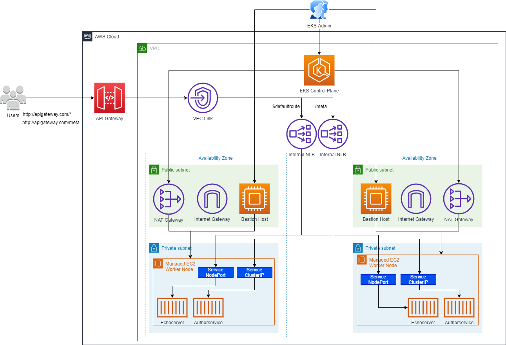

# Eks Load Balancer Controller

Creation of an AWS EKS cluster with load balancer controller and aws controller for kubernetes (ACK).
The load balancer controller is responsible for the creation of two network load balancers, one for each deployment.

<p align="center">
  <a href="#readme">
    
  </a>
</p>

## 0 - Create variables

```sh
export AGW_AWS_REGION=sa-east-1
export AGW_ACCOUNT_ID=$(aws sts get-caller-identity --query 'Account' --output text)
export AGW_EKS_CLUSTER_NAME=EksCluster01
```

## 1 - Create the EC2 key pair

This step should be manual.
We need to create two Keypairs:

* Worker nodes keypair name: eks-key-pair
* Bastion host instance: bastion-host-key-pair

## 2 - Run yml file

```sh
aws cloudformation create-stack --stack-name stack-eks-load-balancer-controller --template-body file://eks-infra.yml --capabilities CAPABILITY_NAMED_IAM
```

### Some important commands

* aws cloudformation validate-template --template-body file://eks-infra.yml

* aws cloudformation delete-stack --stack-name stack-eks-load-balancer-controller

## 3 - Login to bastion host

* Use putty for windows .ppk key pair format. 
If necessary use puttygen to convert from .pem to .ppk

* For MAC or Linux or Windows10

1. Tranfer key pair of the node group instances to bastion host instance:

```sh
pscp -P 22 -i C:\\KeyPairs\\bastion-host-key-pair.ppk C:\\KeyPairs\\eks-key-pair.pem ec2-user@ec2-18-230-57-34.sa-east-1.compute.amazonaws.com:/home/ec2-user/eks-key-pair.pem
```

2. SSH to the bastion host instance

```sh
ssh -i bastion-host-key-pair.pem ec2-user@<Public-IP-of-Bastion-Host>
```

## 4 - Create & Associate IAM OIDC Provider for our EKS Cluster

```sh
eksctl utils associate-iam-oidc-provider --region $AGW_AWS_REGION --cluster $AGW_EKS_CLUSTER_NAME --approve
```

## 5 - Download the IAM policy document

```sh
curl -S https://raw.githubusercontent.com/kubernetes-sigs/aws-load-balancer-controller/v2.2.0/docs/install/iam_policy.json -o iam-policy.json
```

## 6 - Create an IAM policy

```sh
aws iam create-policy --policy-name AWSLoadBalancerControllerIAMPolicy-APIGWEksCluster01 --policy-document file://iam-policy.json 2> /dev/null
```

## 7 - Create a service account

```sh
eksctl create iamserviceaccount \
  --cluster=$AGW_EKS_CLUSTER_NAME \
  --region $AGW_AWS_REGION \
  --namespace=kube-system \
  --name=aws-load-balancer-controller \
  --override-existing-serviceaccounts \
  --attach-policy-arn=arn:aws:iam::${AGW_ACCOUNT_ID}:policy/AWSLoadBalancerControllerIAMPolicy-APIGWEksCluster01 \
  --approve
```
  
## 8 - Get EKS cluster VPC ID

```sh
export AGW_VPC_ID=$(aws eks describe-cluster --name $AGW_EKS_CLUSTER_NAME --region $AGW_AWS_REGION  --query "cluster.resourcesVpcConfig.vpcId" --output text)
```

## 9 - Install AWS Load Balancer Controller

### Connect to the cluster

```sh
aws sts get-caller-identity
aws eks --region $AGW_AWS_REGION update-kubeconfig --name $AGW_EKS_CLUSTER_NAME
kubectl config view --minify
```

### Install Load Balancer Controller

1. Add the EKS chart repo to helm

```sh
helm repo add eks https://aws.github.io/eks-charts && helm repo update
```

2. Install the AWS Load Balancer Controller CRDs - Ingress Class Params and Target Group Bindings

```sh
kubectl apply -k "github.com/aws/eks-charts/stable/aws-load-balancer-controller//crds?ref=master"
```

3. Install the helm chart by passing the serviceAccount.create=false adn serviceAccount.name=aws-load-balancer-controller

```sh
helm install aws-load-balancer-controller \
  eks/aws-load-balancer-controller \
  --namespace kube-system \
  --set clusterName=$AGW_EKS_CLUSTER_NAME \
  --set serviceAccount.create=false \
  --set serviceAccount.name=aws-load-balancer-controller \
  --set vpcId=$AGW_VPC_ID \
  --set region=$AGW_AWS_REGION 
```

## 10 - Deploy the ACK Controller for API Gateway

```sh
curl -O https://raw.githubusercontent.com/aws-samples/amazon-apigateway-ingress-controller-blog/Mainline/apigw-ingress-controller-blog/ack-iam-policy.json

aws iam create-policy \
  --policy-name ACKIAMPolicy \
  --policy-document file://ack-iam-policy.json

eksctl create iamserviceaccount \
  --attach-policy-arn=arn:aws:iam::${AGW_ACCOUNT_ID}:policy/ACKIAMPolicy \
  --cluster=$AGW_EKS_CLUSTER_NAME \
  --namespace=kube-system \
  --name=ack-apigatewayv2-controller \
  --override-existing-serviceaccounts \
  --region $AGW_AWS_REGION \
  --approve

export HELM_EXPERIMENTAL_OCI=1
export SERVICE=apigatewayv2
export RELEASE_VERSION=`curl -sL https://api.github.com/repos/aws-controllers-k8s/apigatewayv2-controller/releases/latest | grep '"tag_name":' | cut -d'"' -f4`
export CHART_EXPORT_PATH=/tmp/chart
export CHART_REF=$SERVICE-chart
export CHART_REPO=public.ecr.aws/aws-controllers-k8s/$CHART_REF
export CHART_PACKAGE=$CHART_REF-$RELEASE_VERSION.tgz

mkdir -p $CHART_EXPORT_PATH

helm pull oci://$CHART_REPO --version $RELEASE_VERSION -d $CHART_EXPORT_PATH
tar xvf $CHART_EXPORT_PATH/$CHART_PACKAGE -C $CHART_EXPORT_PATH
```

### Install ACK

```sh
export ACK_K8S_NAMESPACE=ack-system
```

```sh
helm install --create-namespace --namespace $ACK_K8S_NAMESPACE ack-$SERVICE-controller \
    --set aws.region="$AGW_AWS_REGION" \
    $CHART_EXPORT_PATH/$SERVICE-chart
```

```sh
helm list --namespace $ACK_K8S_NAMESPACE -o yaml
```

## 11 - Install some test applications

```sh
kubectl apply -f author-deployment.yml
kubectl apply -f echoserver.yml
```

After the deploy, check the logs of the aws load balacer controllers pods at the kube-system
namespace:

```sh
kubectl get all -n kube-system
kubectl -n kube-system logs ack-apigatewayv2-controller-XXXX | grep error
kubectl -n kube-system logs ack-apigatewayv2-controller-YYYY | grep error
```

### Troubleshooting applications deployment

If you see some reconciler error, check the following steps:

1. Verify that your service account is associated with the AWS Load Balancer Controller:

```sh
 kubectl get deploy aws-load-balancer-controller -n kube-system -o yaml | grep -i serviceAccount
```

2. See what IAM role is attached to the service account associated with the AWS Load Balancer Controller:

```sh
kubectl describe sa aws-load-balancer-controller -n kube-system | grep role-arn
```

3. Grant ec2:DescribeAvailabilityZones permissions to the IAM role that you identify in step 2.

4. Resolve the single subnet discovery error: ensure that the appropriate tags are associated with the subnets:

* kubernetes.io/role/internal-elb = 1 => for internal load balancer
* kubernetes.io/role/elb = 1 => for internet-facing load balancers

## 12 - Deploy the VPC link

First, we need to run the aws commands in order to get the security group id and
the public subnets id too.

```sh
apiVersion: apigatewayv2.services.k8s.aws/v1alpha1
kind: VPCLink
metadata:
  name: nlb-internal
spec:
  name: nlb-internal
  securityGroupIDs: 
    - $(aws ec2 describe-security-groups --filter Name=vpc-id,Values=$AGW_VPC_ID Name=tag:Name,Values=VPCLink-SecurityGroup --query 'SecurityGroups[*].[GroupId]' --output text)
  subnetIDs: 
    - $(aws ec2 describe-subnets --filter Name=tag:Name,Values=EKS-Cluster-PublicSubnet01 --query 'Subnets[0].SubnetId' --region $AGW_AWS_REGION --output text)
    - $(aws ec2 describe-subnets --filter Name=tag:Name,Values=EKS-Cluster-PublicSubnet02 --query 'Subnets[0].SubnetId' --region $AGW_AWS_REGION --output text)
    - $(aws ec2 describe-subnets --filter Name=tag:Name,Values=EKS-Cluster-PublicSubnet03 --query 'Subnets[0].SubnetId' --region $AGW_AWS_REGION --output text)
```

Next the  following command can be run:

```sh
kubectl apply -f vpclink.yml
aws apigatewayv2 get-vpc-links --region $AGW_AWS_REGION
export AGW_VPCLINK_SG=$(aws ec2 describe-security-groups --filter Name=vpc-id,Values=$AGW_VPC_ID Name=tag:Name,Values=VPCLink-SecurityGroup --query 'SecurityGroups[*].[GroupId]' --output text)
```

The following commands are very helpful in order to debug problems:

```sh
kubectl describe vpclinks.apigatewayv2.services.k8s.aws nlb-internal
```

## 13 - Create API Gateway API

First, we need to run the aws commands in order to get the VPC Link ID and
the load balancers uri:

* VPC Link ID:

```sh
kubectl get vpclinks.apigatewayv2.services.k8s.aws nlb-internal -o jsonpath=\"{.status.vpcLinkID}\"
```

* Load Balancer URI authorservice:

```sh
aws elbv2 describe-listeners \
    --load-balancer-arn $(aws elbv2 describe-load-balancers \
    --region $AGW_AWS_REGION \
    --query "LoadBalancers[?contains(DNSName, '$(kubectl get service authorservice \
    -o jsonpath="{.status.loadBalancer.ingress[].hostname}")')].LoadBalancerArn" \
    --output text) \
    --region $AGW_AWS_REGION \
    --query "Listeners[0].ListenerArn" \
    --output text
```

* Load Balancer URI echoserver:

```sh
aws elbv2 describe-listeners \
    --load-balancer-arn $(aws elbv2 describe-load-balancers \
    --region $AGW_AWS_REGION \
    --query "LoadBalancers[?contains(DNSName, '$(kubectl get service echoserver \
    -o jsonpath="{.status.loadBalancer.ingress[].hostname}")')].LoadBalancerArn" \
    --output text) \
    --region $AGW_AWS_REGION \
    --query "Listeners[0].ListenerArn" \
    --output text
```

You can also find those commands at the apigateway/open-api.json file in order to know the correct place to substitute de id's obtained.

After substituting the id's obtained in the preceeding commands, we need to run the apply:

```sh
kubectl apply -f apigw-api.yml
```

See the results of the preceeding command:

```sh
kubectl describe api apitest-private-nlb
```

### Troubleshooting API Gateway API Creation

1. Check the Status.Conditions.Message field:

```sh
kubectl describe api.apigatewayv2.services.k8s.aws apitest-private-nlb
```

2. Check the logs of the AWS Controller for Kubernetes pod:

```sh
kubectl get pods -n ack-system
kubectl -n ack-system logs ack-apigatewayv2-controller-apigatewayv2-chart-75b87fbbbb-dmwhb | grep error
```

## 14 - Create a stage with auto deploy

1. First, run the following command in order to get the apiID:

```sh
kubectl get apis.apigatewayv2.services.k8s.aws apitest-private-nlb -o=jsonpath='{.status.apiID}'
```

2. Fill in the output at the field apiID in the apigateway/stage.yml file.

3. Run the following command:

```sh
kubectl apply -f stage.yml
```

4. Get the results

```sh
kubectl describe stage.apigatewayv2.services.k8s.aws api
```

## 15 - Invoke API

```sh
kubectl get api apitest-private-nlb -o jsonpath="{.status.apiEndpoint}"
curl $(kubectl get api apitest-private-nlb -o jsonpath="{.status.apiEndpoint}")/api/author/
curl $(kubectl get api apitest-private-nlb -o jsonpath="{.status.apiEndpoint}")/api/meta
```

## 16 - Cleanup

```sh
kubectl delete stages.apigatewayv2.services.k8s.aws apiv1 
kubectl delete apis.apigatewayv2.services.k8s.aws apitest-private-nlb
kubectl delete vpclinks.apigatewayv2.services.k8s.aws nlb-internal 
kubectl delete service echoserver
kubectl delete services authorservice
sleep 10
aws ec2 delete-security-group --group-id $AGW_VPCLINK_SG --region $AGW_AWS_REGION 
helm delete aws-load-balancer-controller --namespace kube-system
helm delete ack-apigatewayv2-controller --namespace ack-system
for role in $(aws iam list-roles --query "Roles[?contains(RoleName, \
  'eksctl-EksCluster01-addon-iamserviceaccount')].RoleName" \
  --output text)
do (aws iam detach-role-policy --role-name $role --policy-arn $(aws iam list-attached-role-policies --role-name $role --query 'AttachedPolicies[0].PolicyArn' --output text))
done
for role in $(aws iam list-roles --query "Roles[?contains(RoleName, \
  'eksctl-EksCluster01-apigw-addon-iamserviceaccount')].RoleName" \
  --output text)
do (aws iam delete-role --role-name $role)
done
sleep 5
aws cloudformation delete-stack --stack-name stack-eks-load-balancer-controller
aws iam delete-policy --policy-arn $(echo $(aws iam list-policies --query 'Policies[?PolicyName==`ACKIAMPolicy`].Arn' --output text))
aws iam delete-policy --policy-arn $(echo $(aws iam list-policies --query 'Policies[?PolicyName==`AWSLoadBalancerControllerIAMPolicy-APIGWEksCluster01`].Arn' --output text))
```
